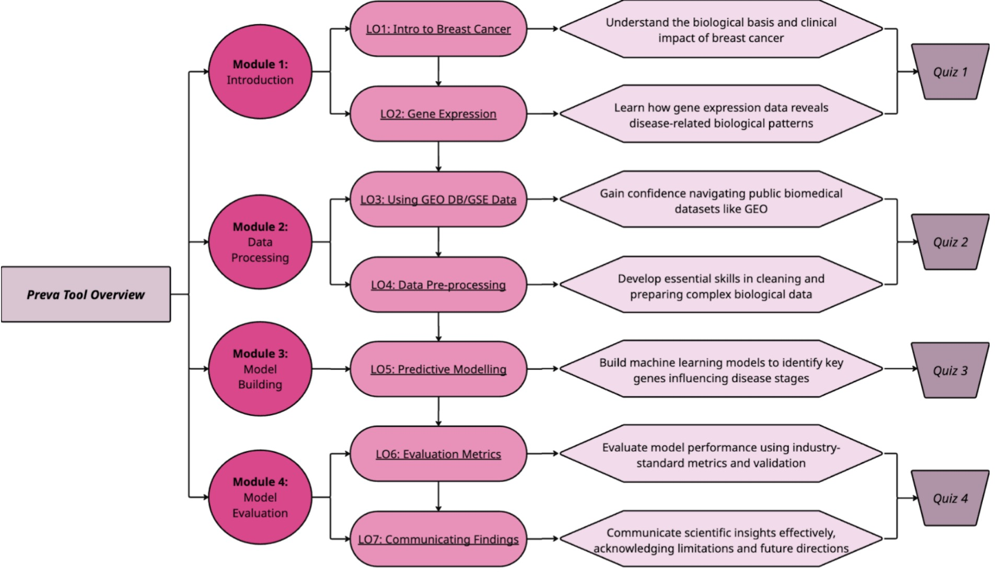

<p align="center">
  
</p>

# Preva – Breast Cancer Risk Calculator
## Project Overview
Preva is an interactive risk calculator that predicts breast cancer severity from gene expression data.

This app was developed as a group project for DATA3888 (2025 S1) at the University of Sydney.  
It is designed as a modular educational tool that guides users from raw data to prediction, helping students and learners explore key bioinformatics workflows in a hands-on way.

<p align="center">
  
</p>

## Key Features

- **Modular Learning Design** — Four guided modules aligned with real-world bioinformatics workflows.
- **Data Processing Tools** — Interactive UI for uploading, filtering, and correcting gene expression data.
- **ML Model Integration** — Train and evaluate predictive models (KNN, RF, SVM) on curated datasets.
- **Educational Visuals** — Embedded quizzes and visual diagrams for reinforcing key concepts.


## Repository Structure

### **Shiny/**

Contains the full Shiny application, including UI, server logic, and pre-processed data used in the app.

Key components:

* [`app.R`](./Shiny/app.R) — Main file to launch the Preva Shiny application.

* [`www/`](./Shiny/www/) — Contains image resources (`.png`) used in the app.

* Pre-processed datasets:

  * [`GSE15852.RData`](./Shiny/GSE15852.RData)
  * [`data_GSE17907.RData`](./Shiny/data_GSE17907.RData)
  * [`data_GSE10810.RData`](./Shiny/data_GSE10810.RData)
  * [`data_Combined.RData`](./Shiny/data_Combined.RData)

  These are **filtered gene expression datasets**, pre-processed and ready for use — no need to download from external databases.

* Pre-trained model files (`.rds`), generated via [`save_models.R`](./Shiny/save_models.R):

  * [`GSE15852_models.rds`](./Shiny/GSE15852_models.rds)
  * [`GSE17907_models.rds`](./Shiny/GSE17907_models.rds)
  * [`Combined_models.rds`](./Shiny/Combined_models.rds)
  * [`comparison_cache.rds`](./Shiny/comparison_cache.rds)

  These files store the results of three predictive models trained on the datasets. They are loaded directly by the app.

* Optional media:

  * [`Record_Demo.mp4`](./Shiny/Record_Demo.mp4) — A recorded demo of the app in use (local video file).


### **Report/**

Contains the group’s final report and associated resources.

Key components:

* [`Report.qmd`](./Report/Report.qmd) — Source Quarto file for the report, written in R Markdown with code folding and custom CSS styling.

* [`Report.html`](./Report/Report.html) — Rendered HTML version of the report.

* Figures and plots:

  * [`figure1.png`](./Report/figure1.png) — *Figure 1: Preva Learning Objectives Overview*, a conceptual diagram.
  * [`figure2.png`](./Report/figure2.png) — *Figure 2: Workflow of data cleaning, processing and model building.*
  * [`report_plot.RData`](./Report/report_plot.RData) — Contains pre-saved plots used in the report body (e.g. *Figure 3: Model Comparison*). Loaded using `load("report_plot.RData")`; includes the `boxplot_plot` object.

* [`custom.css`](./Report/custom.css) — Stylesheet for Preva-specific theming (e.g. heading colors, sidebar highlights, and link styling).

* [`shinypng/`](./Report/shinypng/) — Screenshots of Shiny application functionality, used in the Appendix for illustrative purposes.

> **Last updated:** 1 June 2025
> * [`Click here to view the full report`](./Report/Report.html)


### **Pre-Project/**
  
  Contains our earlier work, including preliminary data exploration and initial Shiny app drafts. Useful for understanding our iterative workflow.

## Datasets
### **Datasets Used**

We used three publicly available **gene expression microarray datasets** from the NCBI GEO repository, each contributing to the training and evaluation of predictive models in Preva. These datasets include samples from breast cancer patients across different tumor grades and subtypes.

#### **GSE15852**

* **Description:** Gene expression profiles from
      • 43 **normal** breast tissue samples
      • 43 **tumor** samples spanning Grades I–III
* **Usage:** Frequently used in breast cancer subtype classification.
* **Gene count:** 22,282
* **NCBI GEO:** [View GSE15852](https://www.ncbi.nlm.nih.gov/geo/query/acc.cgi?acc=GSE15852)

#### **GSE17907**

* **Description:** Enriched for high-grade cases, includes
      • 55 **breast cancer** samples
      • Grade 3 dominant (34 out of 55)
* **Usage:** Highlights more aggressive tumor phenotypes.
* **Gene count:** 24,577
* **NCBI GEO:** [View GSE17907](https://www.ncbi.nlm.nih.gov/geo/query/acc.cgi?acc=GSE17907)

#### **Combined Dataset (GSE10810 + GSE17907)**

* **Description:**  
  **GSE10810**: Moderate-size dataset with 31 tumors  
  **GSE17907**: High-grade enrichment  
  Combined using batch correction for model generalisation

* **Gene count:** 16,760
* **Purpose:** Enables training of more robust predictive models through broader sample representation.


### **Pre-Processed Format**

All datasets were pre-processed and stored as `.RData` objects:

```r
GSE15852.RData
data_GSE17907.RData
data_GSE10810.RData
data_Combined.RData
```

